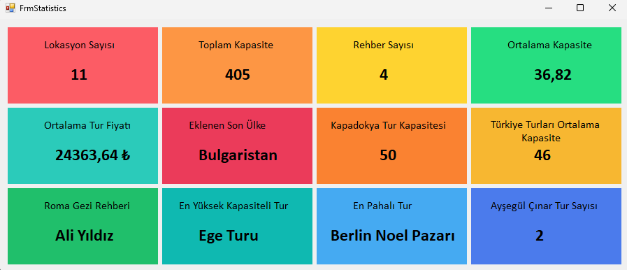

# FrmStatistics

Bu görselde, **C# Eğitim Kampı** kapsamında geliştirilmiş bir Windows Form uygulamasına ait istatistik paneli yer almaktadır. Uygulamada, veritabanı işlemleri için **Entity Framework** kullanılmış ve **LINQ** sorguları aracılığıyla çeşitli veriler analiz edilerek kullanıcı arayüzünde görselleştirilmiştir. İstatistikler arasında lokasyon sayısı, toplam kapasite, rehber sayısı, ortalama tur fiyatı gibi değerler bulunmaktadır. Ayrıca, en yüksek kapasiteli tur ve en pahalı tur gibi özel analizler de yer almaktadır. Görselde, ortalama değerler iki ondalık basamakla formatlanmış ve uygun null kontrolleri ile güvenli bir veri işleme sağlanmıştır. Bu uygulama, hem veri manipülasyon yeteneklerini hem de kullanıcı arayüzü tasarımındaki pratikleri geliştirmek amacıyla hazırlanmıştır. Teknik altyapıda **Entity Framework**'ün `Average`, `Max`, `Sum`, `Count` gibi yöntemleri etkin şekilde kullanılmıştır.

## Uygulama Görseli

